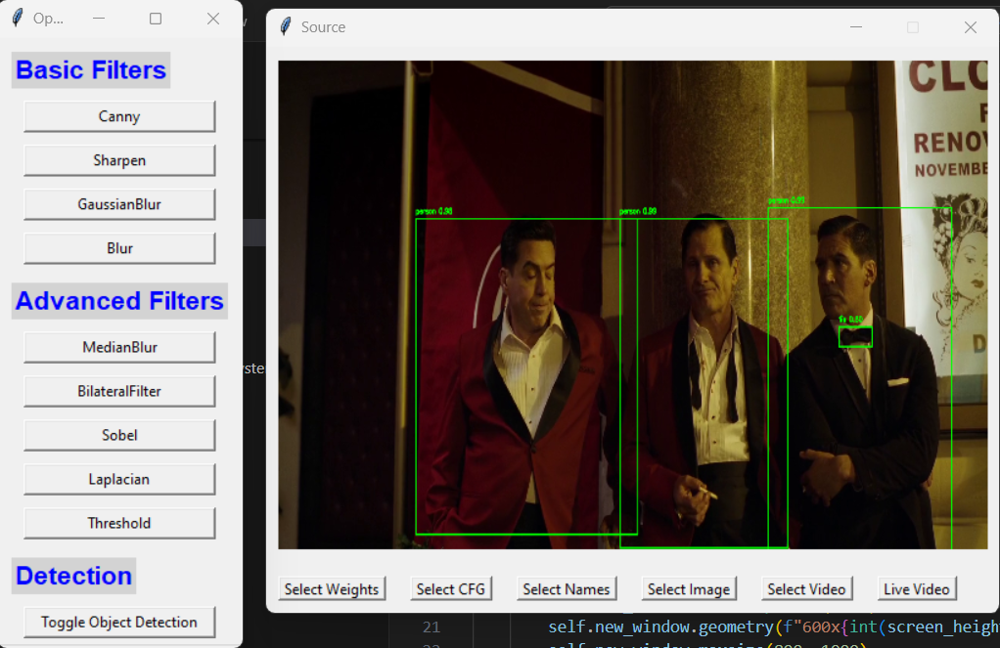

# OpenCV Function Explorer

OpenCV Function Explorer is a Python application that allows users to explore and apply various OpenCV functions on images and videos. The application supports live video processing and YOLO-based object detection.

## Features

- Load and display images and videos
- Apply basic and advanced OpenCV filters
- Toggle YOLO object detection on images and videos
- Process live video from the webcam

## Installation

1. Clone the repository:

   ```sh
   git clone https://github.com/FarrukhTahir5/EzCV2.git
   cd EzCV2
   ```

2. Create a virtual environment and activate it (optional but recommended):

   ```sh
   python -m venv venv
   # On Windows
   venv\Scripts\activate
   # On macOS/Linux
   source venv/bin/activate
   ```

3. Install the required dependencies:

   ```sh
   pip install opencv-python numpy pillow
   ```

4. Run the application:

   ```sh
   python main.py
   ```
## Usage

1. **Download YOLO Files:**

   - **YOLO v3 Configuration File:** [yolov3.cfg](https://github.com/pjreddie/darknet/blob/master/cfg/yolov3.cfg)
   - **YOLO v3 Class Names File:** [coco.names](https://github.com/pjreddie/darknet/blob/master/data/coco.names)
   - **YOLO v3 Weights File:** [yolov3.weights](https://github.com/patrick013/Object-Detection---Yolov3/blob/master/model/yolov3.weights)
2. Launch the application.
3. Use the buttons to load the YOLO weights, configuration file, and class names file.
4. Load an image or video file to process.
5. Apply filters and toggle object detection as needed.

## Dependencies

- Python 3.7+
- OpenCV
- NumPy
- Pillow
- Tkinter
